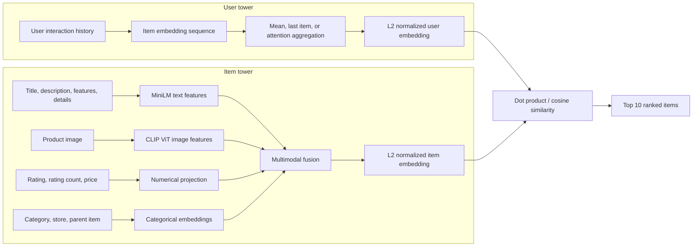

# MultiModal Two-Tower Recommender System

A research project for top K recommendation using a **multimodal two tower architecture**. The system represents users from their interaction histories and represents items from text, images, numerical attributes, and categorical metadata. Both towers produce normalized embeddings whose dot product gives a recommendation score.

This project was developed by **Jiaxuan Yu, Priyanjali Goel, and Zixi Yang**.

## Architecture

The item tower supports concatenation, attention based, and gated fusion. The user tower supports mean pooling, the last interaction, and learned attention over the interaction sequence.

## Dataset

The experiments use anonymized user item interactions and product metadata.

| Statistic | Value |
|---|---:|
| Interactions | 352,239 |
| Users | 323,625 |
| Items | 65,295 |
| Average interactions per user | 1.09 |
| Reported sparsity | 0.999983 |

The data is split by user, with 90% of users used for training and 10% for validation. Keeping every interaction from one user in a single split prevents user leakage. Because most histories contain only one interaction, the reported pipeline augments singleton histories with an item sampled according to global popularity.

## Item features

- **Text:** title, description, features, and details are cleaned, concatenated, and encoded with [`sentence-transformers/paraphrase-MiniLM-L3-v2`](https://huggingface.co/sentence-transformers/paraphrase-MiniLM-L3-v2).
- **Images:** product images are encoded with [`openai/clip-vit-base-patch16`](https://huggingface.co/openai/clip-vit-base-patch16). The image encoder is frozen in the reported experiments.
- **Numerical:** average rating, rating count, and price are cleaned and projected into the shared latent space.
- **Categorical:** product category, store, and parent item identifiers are mapped to learned embeddings, including an unknown category.

Precomputed modality features make model training lightweight and avoid repeatedly running the text and image encoders.

## Training objective

User and item embeddings are L2 normalized, so their dot product is cosine similarity. The study compares:

- Binary cross entropy (BCE)
- Bayesian Personalized Ranking (BPR)
- Hinge loss

Negative items are sampled from items the user has not interacted with. Experiments compare 1, 3, 5, 7, and 10 negatives per positive interaction. Models train for up to 10 epochs with early stopping on validation loss; the selected configuration is then retrained for longer.

## Evaluation

Recommendations are evaluated with **Recall@10**. For each user, the model ranks candidate items by user item similarity and returns the ten highest scoring items.

### Reported findings

| Experiment | Variant | Recall@10 |
|---|---|---:|
| User aggregation | Mean pooling | **0.5047** |
| User aggregation | Attention | 0.4910 |
| User aggregation | Last interaction | 0.4752 |
| Item fusion | Gated fusion | **0.5836** |
| Item fusion | Mean fusion | 0.5047 |
| Item fusion | Attention fusion | 0.3594 |
| Loss | BPR | **0.5074** |
| Loss | BCE | 0.5047 |
| Loss | Hinge | 0.4554 |

These values come from separate ablation experiments and should not be interpreted as results from one jointly optimized configuration. The report also found that performance remained above 0.50 with up to 70% of image features masked, while removing all image information caused a clearer decline. Seven sampled negatives produced the best result in the reported negative sampling comparison.

## Repository contents

The repository currently preserves the earlier baselines used during development:

| File | Purpose |
|---|---|
| `NCF.py` | Neural collaborative filtering baseline |
| `NCF_bert.py` | NCF with BERT derived item representations |
| `NCF_bert2.py` | Revised NCF and text feature experiment |
| `NCF_bert4Rec.py` | Sequential BERT4Rec style experiment |
| `lightgcn_train.py` | LightGCN collaborative filtering baseline |
| `train.csv`, `test.csv` | Interaction data |
| `item_meta.csv` | Item metadata |

The accompanying project report describes the later multimodal two tower system summarized above. The baseline scripts remain useful for comparing collaborative filtering against multimodal retrieval.

## Key limitations

- The interaction matrix is extremely sparse, and most users have too little history for rich sequential modeling.
- Text and image features are precomputed with frozen encoders, so they are not adapted end to end to the recommendation objective.
- Video metadata is not modeled.
- Attention implementations were deliberately lightweight and received limited tuning.
- Reported ablations isolate individual choices; further work is needed to validate a jointly optimized configuration.

## Future work

Promising extensions include stronger modality specific projection layers, end to end encoder fine tuning, context dependent modality fusion, hard negative mining, richer missing modality training, and evaluation on datasets with longer user histories.
